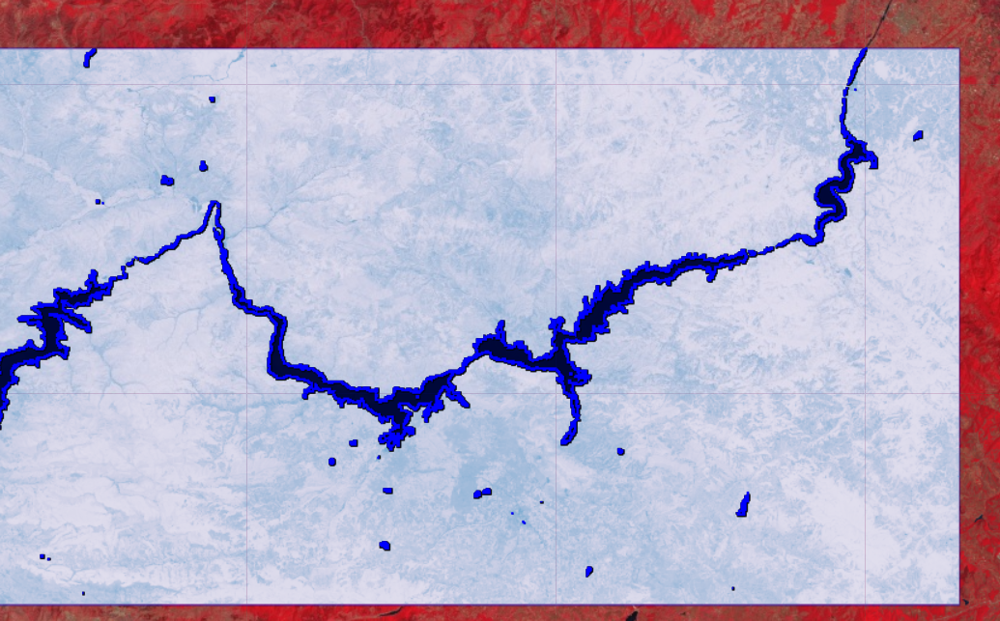

# GEO468E Project Report
 Kübra BIYIK                     010160528
 
Download geemap to view interactive maps in this project : ["To Install Geemap"](https://pypi.org/project/geemap/)
# Calculating and Observing surface water Differences at Kızılırmak
In the project, first of all, Landsat images were used to produce the change of Kızılırmak River between 1985-2019 as a timelapse and an overview was presented.Then, the Image with the lowest cloudiness was selected using USGS Landsat 8 Surface Reflectance Tier 1 images. The reflection values and other properties of the selected image were examined.Since The Normalized Difference Water Index [ NDWI (Green, NIR) ] is widely and successfully used in surface water mass detection and mapping, it was decided to apply it to the selected image. After showing how the indexes were applied, 2 Landsat 8 Surface Reflectance Tier 1 images were selected according to the cloudiness ratio (when I ran the codes, I obtained the images dated 2017-07-13 and 2019-11-08) NDWI indexes were applied and then masked with the Thresholding method. Water pixels in different images were obtained. Pixels were converted from raster to vector data and their differences were calculated in km. The Kızılırmak River, which was 161 km in the image dated 2017-07-13, was calculated as 156 km in the image dated 2019-11-08. The change over the years was determined in km and displayed graphically.

An interactive map created via geemap as shown, NIR - SWIR1 - RED False-Color Band Combination is used for observing water dynamics
## Interactive Map

### Best cloud-free image

## Normalized Difference Water Index (NDWI)

***
- bu normal fontlu fontlu
- _bu italic fontlu_
- *bu da italic*
- __bu kalın fontlu bi cümle__

'''Python
    def forward(self,x):
    
    ?
    
'''

