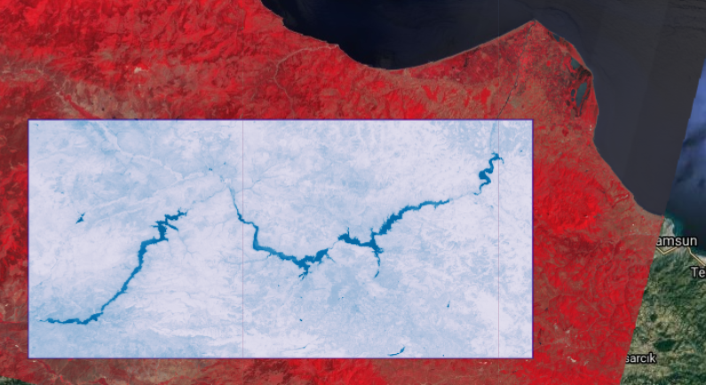
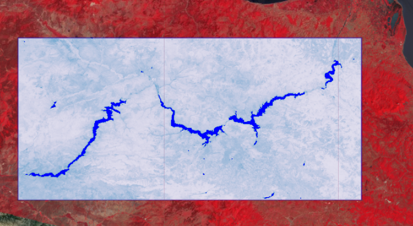
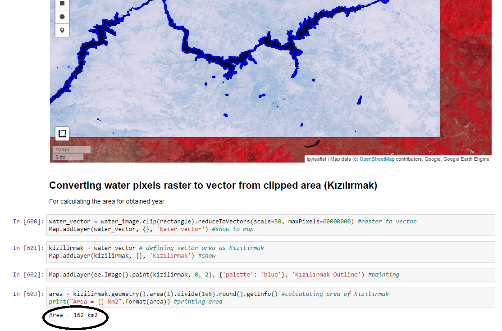
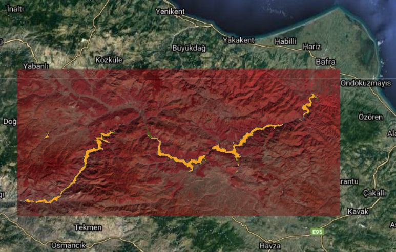
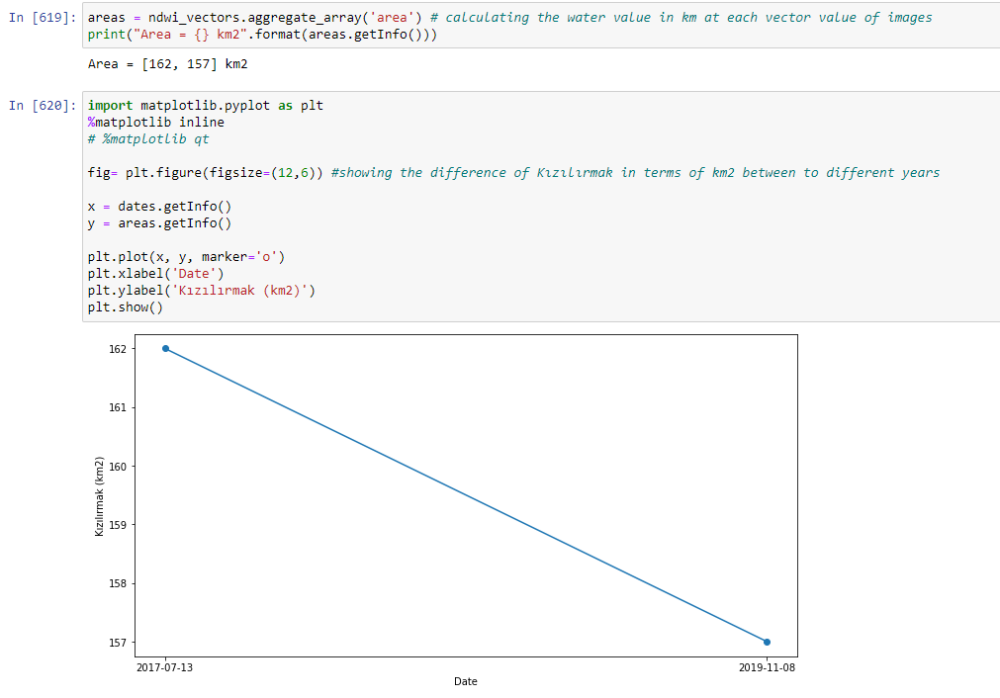
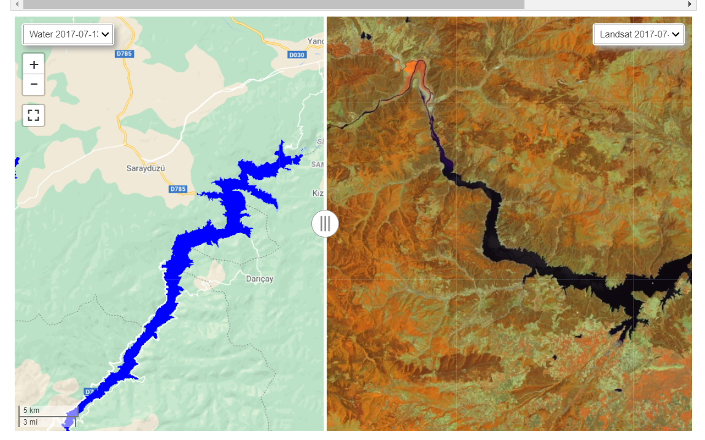

# GEO468E Project Report
 Kübra BIYIK                     010160528
 
-Download geemap to view interactive maps in this project : ["To Install Geemap"](https://pypi.org/project/geemap/)
*The project is described superficially, see the jupyter notebook file for a more detailed explanation.*
# Calculating and Observing surface water Differences at Kızılırmak
In the project, first of all, Landsat images were used to produce the change of Kızılırmak River between 1985-2019 as a timelapse and an overview was presented.Then, the Image with the lowest cloudiness was selected using USGS Landsat 8 Surface Reflectance Tier 1 images. The reflection values and other properties of the selected image were examined.Since The Normalized Difference Water Index [ NDWI (Green, NIR) ] is widely and successfully used in surface water mass detection and mapping, it was decided to apply it to the selected image. After showing how the indexes were applied, 2 Landsat 8 Surface Reflectance Tier 1 images were selected according to the cloudiness ratio (when I ran the codes, I obtained the images dated 2017-07-13 and 2019-11-08) NDWI indexes were applied and then masked with the Thresholding method. Water pixels in different images were obtained. Pixels were converted from raster to vector data and their differences were calculated in km. The Kızılırmak River, which was 161 km in the image dated 2017-07-13, was calculated as 156 km in the image dated 2019-11-08. The change over the years was determined in km and displayed graphically.

## Interactive Map
An interactive map created via geemap as shown, NIR - SWIR1 - RED False-Color Band Combination is used for observing water dynamics

## Best cloud-free image
Images filtered the ImageCollection by roi and date, and then sort by cloud cover.

For Learning how many Landsat 8 images are available for the study area at the range 2015-2019 codeS runned.
Image properties were examined to check the pixel values and spectral signature. Also from Toolbar button on map, Plotting and Inspector informations of Image is taken into consideration. LANDSAT/LC08/C01/T1_SR/LC08_176031_20170713 has the best cloud ratio

## Normalized Difference Water Index (NDWI)
It is widely used for monitoring changes on earth related to water content in water bodies on earth observations, It is formulated with green and NIR wavelengths. Its formula : ( X(green) - X(NIR) ) / ( X(green) + X(NIR) )

## Extracting Water pixels from Image that clipped

## Converting water pixels raster to vector from clipped area (Kızılırmak)

### *Calculating Area of Pixels*

## Applying Calculating Process to chosen 2 different images
- For observing and calculating differences between two years of defined area (in this case Kızılırmak), we calculate the water pixels in km from two different Image and compare each other.
- First, Images with optimum cloudiness were obtained from USGS Landsat 8 Surface Reflectance Tier 1 images and 2 images obtained. '2017-07-13'and '2019-11-08'

### * Areas are calculated

## Splited Map of Area are Created
On the left is the extracted water pixels from the images, on the right is the False color band combinations of the Images.

